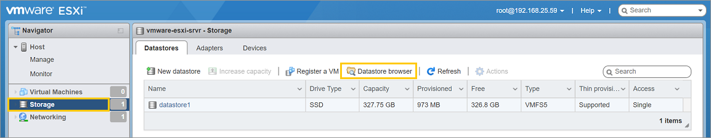
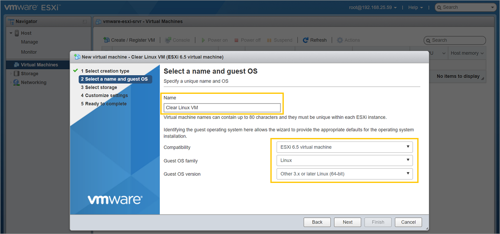
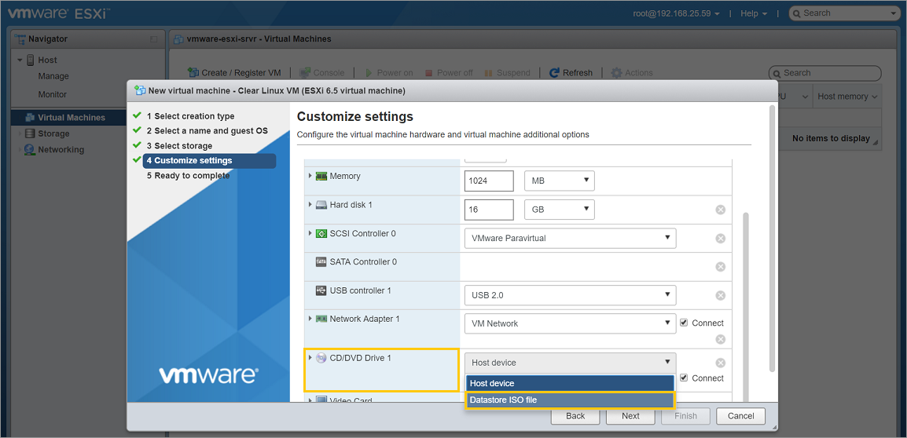
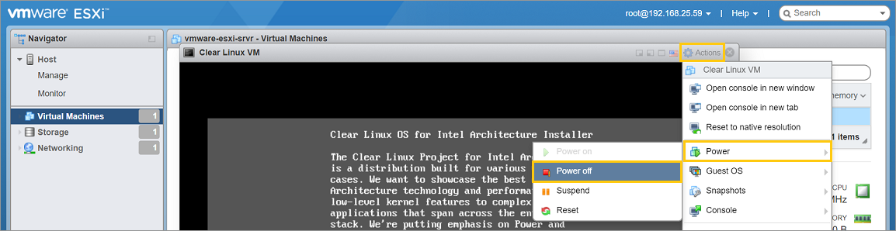
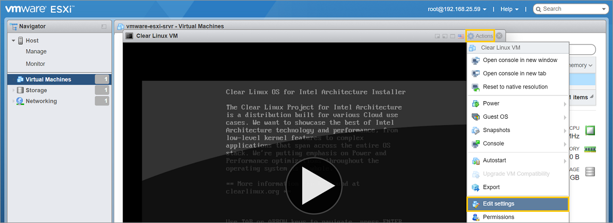
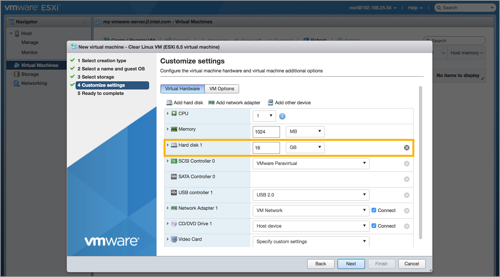
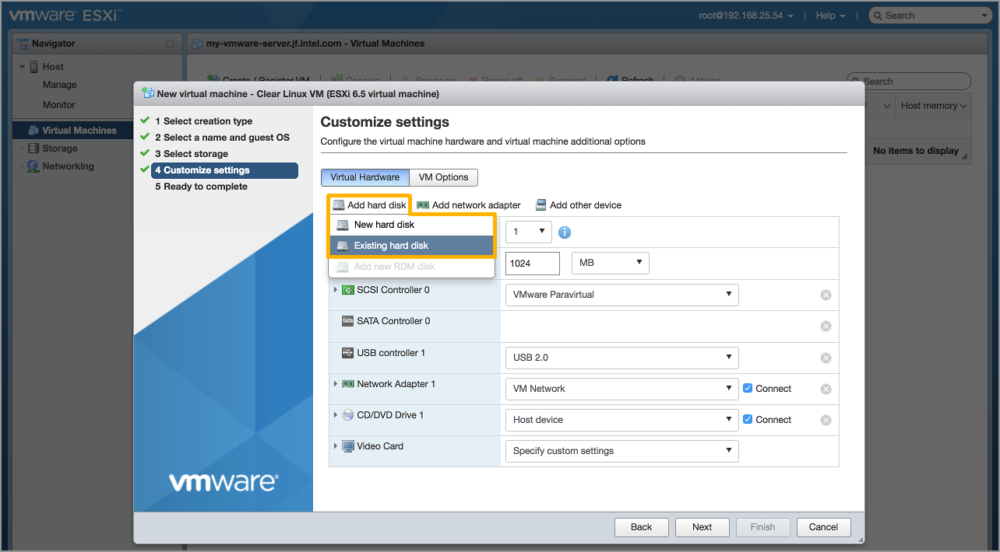
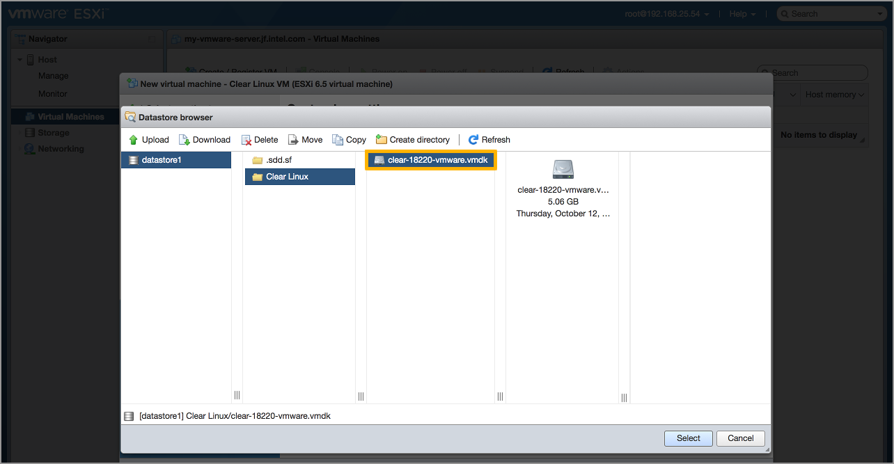

.. _vmware-esxi-esxi-2:

Run |CL| as a VMware* ESXi guest OS
###################################

This section explains how to run |CLOSIA| in a virtualized environment using 
VMware ESXi 6.5 Update 1. 

There are 2 ways to create a |CL| VM to run in VMware:

* `Method 1`: Fresh installation of |CL| into new VM.  This provides flexibility 
  in configuring the VM size, partitions, initial bundles installation, etc.
* `Method 2`: Use a ready-made VMware |CL| image with minimally required bundles.

Both methods are discussed below.

Download the latest |CL| image
==============================

Go to the |CL| `image`_ repository and download the desired type:

* ISO installer image: `clear-<version>-installer.iso.xz` (for Method 1)
* VMware image: `clear-<version>-basic.vmdk.xz` (for Method 2)

For older versions, see the `releases`_ page.

Although not required, it is recommended to download the corresponding 
checksum file (designated with `-SHA512SUMS` at the end of the filename) 
for the image in order to verify its integrity.

Verify the integrity of the download (recommended)
==================================================

* For Linux distros and macOS:

  #.  Start a terminal emulator.
  #.  Go to the directory with the downloaded files.
  #.  To verify the integrity of the image, enter the following (an installer ISO
      image is used as an example):

      .. code-block:: console

        $ sha512sum ./clear-<version>-installer.iso.xz | diff ./clear-<version>-installer.iso.xz-SHA512SUMS -

      If the checksum of the downloaded image is different than the original
      checksum, the differences will displayed. An empty output indicates a match.

* For Windows:

  #.  Start Command-Prompt.
  #.  Go to the directory with the downloaded files.
  #.  To verify the integrity of the image, enter the following commands:

      .. code-block:: console

        C:\> CertUtil -hashfile ./clear-<version>-installer.iso.xz | findstr -v file

      Compare the output with the original checksum to make sure they match.

Uncompress the image
====================

* For Linux distros (an installer ISO image is used as an example):

  .. code-block:: console

    $ unxz clear-<version>-installer.iso.xz

* For macOS:

  .. code-block:: console

    $ gunzip clear-<version>-installer.iso.xz

* For Windows:

  Use `7zip`_ to uncompress it.

Method 1: Fresh install of |CL| into a new VM 
=============================================

The general process for performing a fresh install of |CL| into a new VM is 
as follows (with expanded details below):

* Upload the |CL| installer ISO the VMware server
* Create a new VM and configure its settings
* Attach the installer ISO to it
* Install |CL|
* Detach the installer ISO
* Change the boot option from BIOS to EFI
* Power on the VM

Upload the |CL| installer ISO to the VMware server
**************************************************

#.  Connect to the VMware server and log into an account with root privilege.
#.  Under the `Navigator` window, go to `Storage`.
#.  Click `Datastore browser`.
    
    |vmware-esxi-01|

    Figure 1: VMware ESXi - Navigator > Storage 

#.  Click `Create directory` and name it `ISOs`.

    |vmware-esxi-02|

    Figure 2: VMware ESXi - Datastore > Create directory 
   
#.  Select the newly created directory and click `Upload`.

    |vmware-esxi-03|

    Figure 3: VMware ESXi - Datastore > Upload ISO 
   
#.  Select the |CL| installer ISO file (i.e. `clear-<version>-installer.iso`) 
    and upload it.

Create a new VM and configure its settings
******************************************

#.  Connect to the VMware server and log into an account with root privilege.
#.  Under the `Navigator` window, go to `Virtual Machines`.
#.  On the right window, click `Create / Register VM`.

    |vmware-esxi-04|

    Figure 4: VMware ESXi - Navigator > Virtual Machines
   
#.  On the `Select creation type` step:
    
    * Select `Create a new virtual machine`.  
    * Click `Next`.

      |vmware-esxi-05|

      Figure 5: VMware ESXi - Create a new virtual machine
   
#.  On the `Select a name and guest OS` step:

    * Give the new VM a name.  
    * Set `Compatability` to `ESXi 6.5 virtual machine`.
    * Set `Guest OS family` to `Linux`.
    * Set `Guest OS version` to `Other 3.x or later Linux (64-bit)`.
    * Click `Next`.

      |vmware-esxi-06|

      Figure 6: VMware ESXi - Give a name and select guest OS type

#.  On the `Select storage` step:

    * Accept the default option.
    * Cnd click `Next`.

#.  On the `Customize settings` > `Virtual Hardware` step:
    
    * Under `CPU`, enable `Hardware virtualization` by checking `Expose hardware
      assisted virtualization to the guest OS`.

      |vmware-esxi-07|
      
      Figure 7: VMware ESXi - Enable hardware virtualization

    * Set `CD/DVD Drive 1` to `Datastore ISO file` and select the |CL| 
      installer ISO (i.e. `clear-<version>-installer.iso`) that was previously 
      uploaded to the VMware server.
    * Click `Next`.

      |vmware-esxi-08|

      Figure 8: VMware ESXi - Set CD/DVD to boot installer ISO

#.  Click `Finish`.

Install |CL| into the new VM
****************************

#.  Power on the VM.
    
    * Select the newly created VM and click `Power on`.  
    * Click on the icon representing the VM to maximize and bring it into view.  

      |vmware-esxi-09|

      Figure 9: VMware ESXi - Navigator > Virtual Machines > Power on VM

#.  Follow the :ref:`bare-metal-install` (starting at the `Install Clear Linux 
    on your target system` section) guide to complete the installation of 
    |CL|.
#.  After the installation is complete, follow the |CL| instruction to reboot it.  
    This will restart the installer again.  Follow the next section. 

Reconfigure the settings to boot the newly installed |CL| VM
************************************************************

#.  Power off the VM.

    * Click `Actions` (top-right corner) and go to `Power` and select `Power off`.  

      |vmware-esxi-10|

      Figure 10: VMware ESXi - Actions > Power off

#.  Edit the VM settings.

    * Click `Actions` again and select `Edit settings`.  

      |vmware-esxi-11|

      Figure 11: VMware ESXi - Actions > Edit settings

#.  Disconnect the CD/DVD to stop it from booting the installer ISO again.
    
    * Under `Virtual Hardware` > `CD/DVD Drive 1`, uncheck `Connect`. 

      |vmware-esxi-12|

      Figure 12: VMware ESXi - Disconnect CD/DVD drive

#.  |CL| needs UEFI support in order to boot.  Enable UEFI boot support.

    * Under `VM Options` > `Boot Options` > `Firmware`, select `EFI`.

      |vmware-esxi-13|

      Figure 13: VMware ESXi - Set boot firmware to EFI

#.  Click `Save`.

Power on the virtual machine
****************************

After configuring the settings above, power on the virtual machine.  

Method 2: Use a ready-made VMware |CL| image 
=============================================

The general process for using a ready-made VMware |CL| image is as follows 
(with expanded details below):

* Upload the ready-made VMware |CL| image to the VMware server
* Convert the VMware |CL| image to an ESXi-supported format
* Create a new VM and configure its base settings
* Attach the ready-made VMware |CL| image
* Enable EFI boot support
* Power on the VM

Upload the VMware |CL| image to the VMware server
*************************************************

#.  Connect to the VMware server and log into an account with root privilege.
#.  Under the `Navigator` window, go to `Storage`.
#.  Click `Datastore browser`.
    
    |vmware-esxi-01|

    Figure 14: VMware ESXi - Navigator > Storage 

#.  Click `Create directory` and name it `Clear Linux VM`.

    |vmware-esxi-02|

    Figure 15: VMware ESXi - Datastore > Create directory 
   
#.  Select the newly created directory and click `Upload`.

    |vmware-esxi-16|

    Figure 16: VMware ESXi - Datastore > Upload VMware image 

#.  Select the VMware |CL| image file (i.e. `clear-<version>-basic.vmdk`) and 
    upload it.
   
Convert the VMware |CL| image to an ESXi-supported format
*********************************************************

#.  SSH into the VMware server and log into an account with root privilege.
#.  Locate the uploaded image, which is typically found in `/vmfs/volumes/datastore1`.
#.  Execute this command to perform the conversion:

    .. code-block:: console

      # vmkfstools -i clear-<version>-basic.vmdk -d zeroedthick clear-<version>-esxi.vmdk

    Two files should result from this:

    * `clear-<version>-esxi-flat.vmdk`
    * `clear-<version>-esxi.vmdk`

Create a new VM and configure its base settings
***********************************************

#.  Connect to the VMware server and log into an account with root privilege.
#.  Under the `Navigator` window, go to `Virtual Machines`.
#.  On the right window, click `Create / Register VM`.

    |vmware-esxi-04|

    Figure 17: VMware ESXi - Navigator > Virtual Machines

#.  On the `Select creation type` step, select `Create a new virtual machine`  
    and click `Next`.

    |vmware-esxi-05|

    Figure 18: VMware ESXi - Create a new virtual machine
   
#.  On the `Select a name and guest OS` step:

    * Give the new VM a name.  
    * Set `Compatability` to `ESXi 6.5 virtual machine`.
    * Set `Guest OS family` to `Linux`.
    * Set `Guest OS version` to `Other 3.x or later Linux (64-bit)`.
    * Click `Next`.

      |vmware-esxi-06|

      Figure 19: VMware ESXi - Give a name and select guest OS type

#.  On the `Select storage` step:

    * Accept the default option.
    * Click `Next`.

#.  On the `Customize settings` > `Virtual Hardware` step:
    
    * Under `CPU`, enable `Hardware virtualization` by checking `Expose hardware
      assisted virtualization to the guest OS`.

      |vmware-esxi-07|
      
      Figure 20: VMware ESXi - Enable hardware virtualization

    * Remove the default `Hard drive 1` feature.
    * For `CD/DVD Drive 1`, uncheck `Connect`.
    * Click `Add hard disk` > `Existing hard drive` and select the ready-made 
      VMware |CL| image that was previously uploaded to the VMware server.   

    |vmware-esxi-19|

    Figure 19: VMware ESXi - Customize virtual hardware settings > Remove default hard drive

    * Click `Add hard disk` and select `Existing hard disk`.

    |vmware-esxi-20|

    Figure 20: VMware ESXi - Customize virtual hardware settings
 
    |vmware-esxi-21|

    Figure 21: VMware ESXi - Select |CL| VMware image

#.  On the `Customize settings` > `VM Options` step:
    
    * Select `Boot Options` > `Firmware`, select `EFI`.

    |vmware-esxi-12|

    Figure 22: VMware ESXi - Set boot firmware to EFI

#.  Click `Next`.
#.  Click `Finish`.
#.  Select the newly created VM and click `Power on`.  
#.  Click on the icon representing the VM to maximize and bring it into view.  

    |vmware-esxi-08|

    Figure 23: VMware ESXi - Navigator > Virtual Machines > Power on VM

.. _7zip: http://www.7-zip.org/
.. _VirtualBox: https://www.virtualbox.org/
.. _image: https://download.clearlinux.org/image
.. _releases: https://download.clearlinux.org/releases

.. |vmware-esxi-02| image:: figures/vmware-esxi/vmware-esxi-2.png
.. |vmware-esxi-03| image:: figures/vmware-esxi/vmware-esxi-3.png
.. |vmware-esxi-04| image:: figures/vmware-esxi/vmware-esxi-4.png
.. |vmware-esxi-05| image:: figures/vmware-esxi/vmware-esxi-5.png

.. |vmware-esxi-07| image:: figures/vmware-esxi/vmware-esxi-7.png

.. |vmware-esxi-09| image:: figures/vmware-esxi/vmware-esxi-9.png

.. |vmware-esxi-12| image:: figures/vmware-esxi/vmware-esxi-12.png
.. |vmware-esxi-13| image:: figures/vmware-esxi/vmware-esxi-13.png
.. |vmware-esxi-16| image:: figures/vmware-esxi/vmware-esxi-16.png

